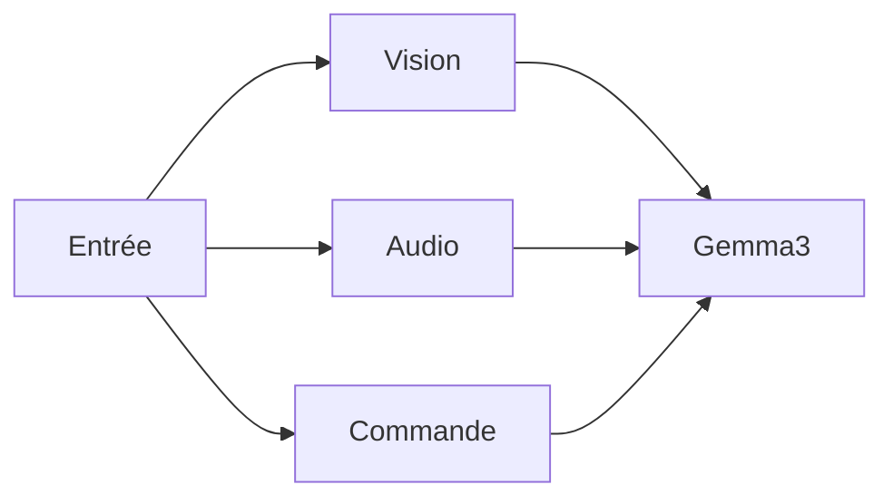
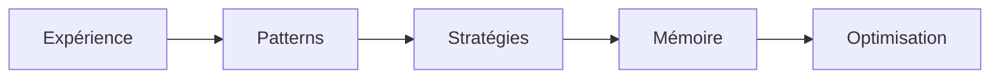

# Architecture Détaillée de Polyad

## 1. Composants Principaux

### 1.1 Noyau (core/)

#### Polyad (`polyad.py`)
- Moteur de traitement principal
- Interface avec Gemma3 via Ollama
- Gestion des ressources système
- Traitement parallèle (6 threads)
- Monitoring des performances

#### Agent Autonome (`autonomous_agent.py`)
- Coordination des capacités
- Gestion de l'apprentissage
- Interface sensorielle
- Contrôle des actions
- Sécurité et validation

### 1.2 Capacités Sensorielles

#### Vision
```python
async def process_visual(self, image_path: Optional[str] = None):
    # Capture d'image (caméra ou fichier)
    # Prétraitement (resize 512x512)
    # Analyse via Gemma3
    # Retour des résultats
```

#### Audio
```python
async def process_audio(self, duration: int = 5):
    # Enregistrement audio
    # Conversion en texte
    # Analyse via Gemma3
    # Retour des résultats
```

#### Action
```python
async def execute_action(self, action: Dict[str, Any]):
    # Validation de sécurité
    # Exécution (GUI ou système)
    # Monitoring des résultats
```

### 1.3 Apprentissage

#### Meta-Learning
```python
async def learn_from_experience(self, experience: Dict[str, Any]):
    # Extraction de patterns
    # Mise à jour des stratégies
    # Évaluation des performances
    # Stockage vectoriel
```

#### Few-Shot Learning
- Base d'exemples dynamique
- Adaptation rapide
- Évaluation continue

#### Apprentissage Contextuel
- Détection de contexte
- Adaptation des stratégies
- Optimisation des ressources

## 2. Flux de Données

### 2.1 Entrée


### 2.2 Traitement


### 2.3 Apprentissage


## 3. Système de Mémoire

### 3.1 Vector Store (FAISS)
- Dimension: 384
- Index: FlatL2
- Recherche rapide

### 3.2 Base de Connaissances
- SQLite
- Mises à jour incrémentales
- Indexation efficace

## 4. Optimisation des Ressources

### 4.1 CPU
- Monitoring via psutil
- Seuils adaptatifs
- Parallélisation

### 4.2 Mémoire
- Gestion dynamique
- Nettoyage automatique
- Cache intelligent

### 4.3 GPU (si disponible)
- Quantification automatique
- Batch processing
- Monitoring thermique

## 5. Sécurité

### 5.1 Actions Système
- Validation préalable
- Restrictions d'accès
- Logging détaillé

### 5.2 GUI
- Fail-safe PyAutoGUI
- Zones sécurisées
- Timeouts

## 6. État et Persistance

### 6.1 Sauvegarde
```python
async def save_state(self):
    # État d'apprentissage
    # Mémoire vectorielle
    # Base de connaissances
    # Statistiques
```

### 6.2 Chargement
```python
async def load_state(self):
    # Restauration état
    # Vérification intégrité
    # Initialisation composants
```

## 7. Monitoring

### 7.1 Performances
- Temps de réponse
- Utilisation ressources
- Taux de succès

### 7.2 Apprentissage
- Progrès
- Adaptations
- Optimisations

## 8. Interface

### 8.1 CLI (`demo.py`)
- Tests interactifs
- Monitoring temps réel
- Contrôle manuel

### 8.2 API Future
- REST
- WebSocket
- Interface web

## 9. Dépendances

### 9.1 Principales
- Ollama (Gemma3)
- OpenCV
- PyAutoGUI
- FAISS
- SpeechRecognition

### 9.2 Système
- macOS
- Python 3.8+
- 32GB RAM recommandé
- GPU optionnel

## 10. Développement Futur

### 10.1 Court Terme
- Optimisation mémoire
- Cache distribué
- Tests unitaires

### 10.2 Long Terme
- Multi-GPU
- Clustering
- Auto-modification sécurisée
